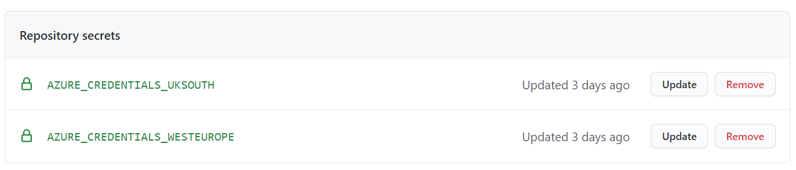

### Create an unmanaged cluster

Create a few on-premises Kubernetes clusters. This is simulated using k3s by Rancher running on a single Azure VM.

1. Open [**Cloud Shell**](https://shell.azure.com/)
2. Execute this code to create a resource group and copy the credential output

```bash
LOCATION=uksouth
# - or -
LOCATION=westeurope
```

```bash
RG_ID=$(az group create -n "arc4k8s-${LOCATION}" -l "${LOCATION}" -o tsv --query 'id')
AZURE_CREDENTIALS=$(az ad sp create-for-rbac --sdk-auth --role contributor --scopes $RG_ID)

echo "Copy this output into a GitHub secret with the name: 'AZURE_CREDENTIALS_${LOCATION^^}'"
echo "You will use this to allow GitHub to deploy the appropriate resources"

echo $AZURE_CREDENTIALS

```

3. [Create a child repository](//github.com/jasoncabot-ms/arc-for-kubernetes/generate) from this template, you can call it something like `arc-for-kubernetes` but the name doesn't matter
4. Add a secret called `AZURE_CREDENTIALS_<region>` with value of the `AZURE_CREDENTIALS` output. The name does not matter but you will use it when you run the workflow to deploy a cluster to know which secret to access.
> This secret allows GitHub access to Azure resources within the resource group created in Step 2

As an example, your GitHub repository should appear like this


5. Run the **Deploy Cluster** workflow from [GitHub Actions](../../actions) specifying the secret name you added in step 4


### Troubleshooting

1. Ensure you create a Service Principal with appropriate access, especially note the `sdk-auth` for appropriate formatting of the secret and `scopes` for what you want the GitHub Action to be able to modify
2. If you get a status code 400 error when creating the Service Principal, try to login to the Azure CLI again using `az login`
